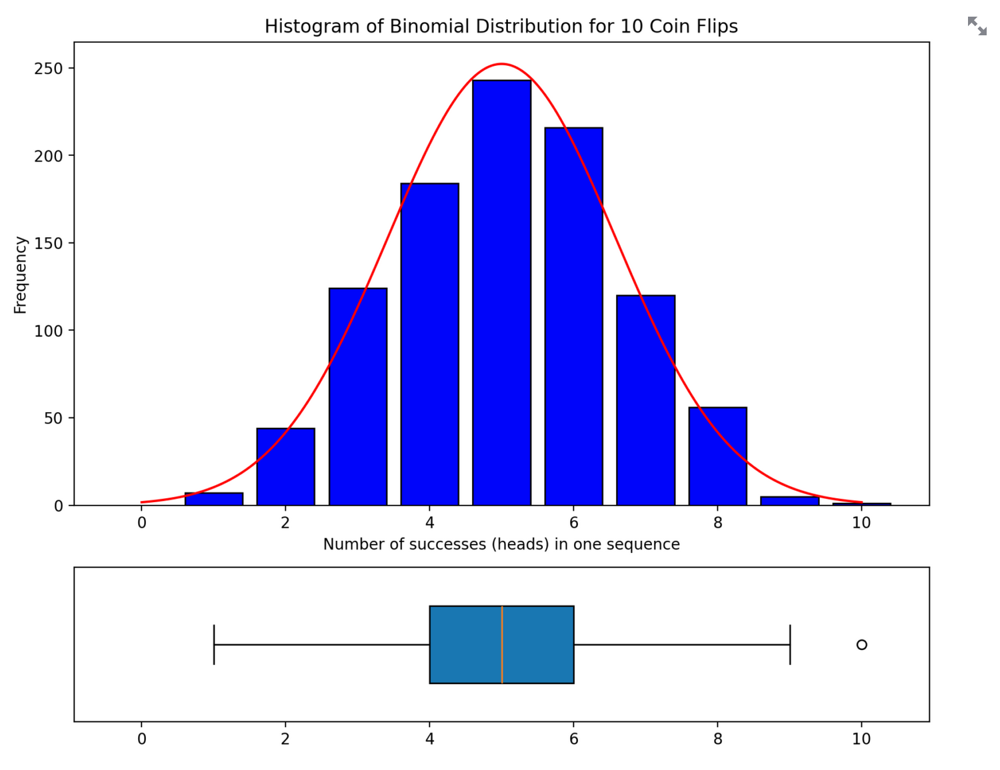

# Learn about Binomial Distributions!

[](https://binomial-distribution.streamlit.app)



## Try it locally:
```
pip install -r requirements.txt
streamlit run app.py
```

## Problems, Questions, Suggestions? 
* I encourage all issues or suggestions to be submitted through the [**Issues** tab on GitHub](https://github.com/freddyouellette/binomial-distribution/issues).
* Pull requests are welcome.

## Support Me
[](https://www.paypal.com/donate/?hosted_button_id=3PJ9XD363CC5E)

Bitcoin: `bc1qs39glh9cwsef0qv40dny6ajnweqe2le7ynfgr2`

Ethereum: `0x5Baba8708b8676afBFF2974b4af4894Fc12aE242`